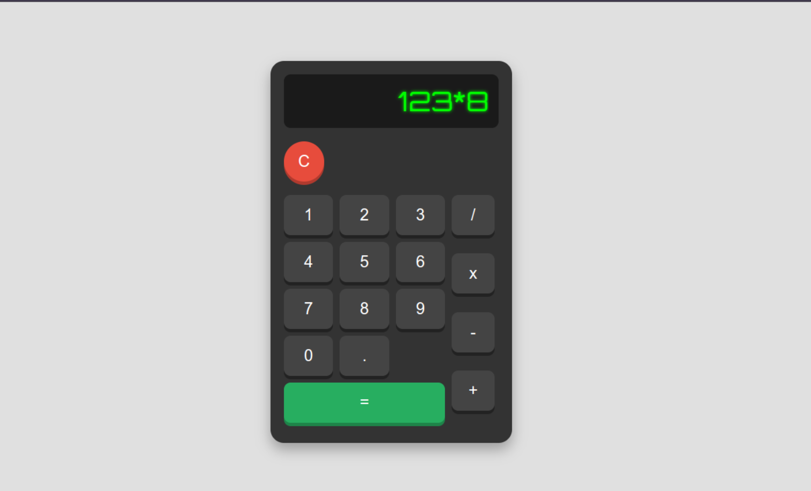

# Calculatrice Web

Cette calculatrice web est un projet simple mais fonctionnel, conçu avec HTML, CSS et JavaScript. L'interface a été stylisée pour imiter l'apparence d'une véritable calculatrice, avec des boutons en relief et un écran LCD réaliste.

## Démo



## Fonctionnalités

- **Affichage** : Un écran LCD simulé pour afficher les chiffres et les opérations.
- **Boutons Numériques** : Boutons de 0 à 9, avec un bouton décimal (`.`).
- **Opérations de Base** : Addition, soustraction, multiplication, division.
- **Bouton Clear (`C`)** : Efface l'écran pour une nouvelle opération.
- **Bouton Égal (`=`)** : Calcule et affiche le résultat de l'opération.

## Technologies Utilisées

- **HTML5** : Structure de la calculatrice.
- **CSS3** : Stylisation réaliste et moderne des éléments.
- **JavaScript** : Gestion des opérations mathématiques et des interactions utilisateur.

## Installation

1. **Clonez le repository :**
   ```bash
   git clone https://github.com/eadarak00/simple-calculator
   ```

2. **Naviguez vers le dossier du projet :**
   ```bash
   cd simple-calculator
   ```

3. **Ouvrez `index.html` dans votre navigateur :**
   ```bash
   open index.html
   ```
   ou simplement double-cliquez sur le fichier `index.html`.

## Structure du Projet

- **index.html** : Contient la structure HTML de la calculatrice.
- **style.css** : Contient les styles CSS pour la calculatrice, y compris le design réaliste.
- **script.js** : Contient le code JavaScript pour les fonctionnalités de la calculatrice.

## Améliorations Futures

- **Ajout de nouvelles fonctionnalités** : Calculs scientifiques, stockage d'historique, etc.
- **Internationalisation** : Support de plusieurs langues.
- **Accessibilité** : Amélioration de l'accessibilité pour les utilisateurs de lecteurs d'écran.

## Auteur

- **Nom de l'auteur** : [El Hadji Abdou DRAME](https://www.linkedin.com/in/elhadji-abdou-drame/)

## Note

**NB** : Ceci est la première version du projet. Des améliorations et des mises à jour sont prévues pour les versions futures.